<picture>
  <source media="(max-width: 700px)" srcset="./assets/shiverion-signal-mobile.svg">
  
</picture>

<h1 align="center">AI systems that can show their work.</h1>

  I build agent tools, evaluation pipelines, and production AI products — 
  with the evidence, constraints, and failure boundaries documented beside the result.

  
  
  
  
  
  

  <samp>
    <a href="#about">ABOUT</a> ·
    <a href="#selected-work">SELECTED WORK</a> ·
    <a href="#how-this-index-is-curated">DEPTH GUIDE</a> ·
    <a href="#project-index">PROJECT INDEX</a> ·
    <a href="#capabilities">CAPABILITIES</a> ·
    <a href="#connect">CONNECT</a>
  </samp>

Index reviewed 2026-08-29

---

## About

I'm **Muhammad Iqbal Hilmy Izzulhaq** (`@Shiverion`), an AI engineer and data scientist working where **agents, retrieval, evaluation, and product engineering** meet.

My work ranges from Indonesian legal-document research and bioinformatics evidence triage to MCP tool servers, real-time voice products, fine-tuned language models, and leakage-safe forecasting. The common thread is simple: define the decision clearly, make the system's boundaries visible, and measure whether it works.

> **Working principle:** AI should know its limits, show its evidence, and earn its place in a real workflow.

| Measured outcome | Where it comes from |
| ---: | --- |
| **300 human-reviewed QA pairs** | [VerdictBench](https://github.com/Shiverion/VerdictBench-LCvsRAG) |
| **16–25× lower cost** for Dense RAG in the evaluated setup | [VerdictBench paper](https://openreview.net/forum?id=46hzq45LPE) |
| **33,983 rows audited · 224 cross-condition genes** | [T-cell Evidence Workbench](https://github.com/Shiverion/t-cell-evidence-workbench) |
| **40% → 73.5% valid SQL** after QLoRA fine-tuning | [Text2SQL fine-tuning](https://github.com/Shiverion/text2sql-finetuning) |
| **98% less memory · up to 100× faster** under benchmarked workloads | [Dataframe benchmark case study](https://shiverion.com/projects/dataframe-benchmark) |
| **384-match chronological backtest** across six World Cup windows | [World Cup 2026 engine](https://github.com/Shiverion/ml-world-cup-prediction) |
| **Caught an eval bug hiding 45% of true FD002 error** | [AeroRUL](https://github.com/Shiverion/AeroRUL) |
| **Retracted its own headline finding after a null-model test (p≈0.005)** | [HealthReach Indonesia](https://github.com/Shiverion/HealthReach-Indonesia) |
| **+5.89pp fire-to-forest-loss association, explicitly non-causal** | [Indonesia Wildfire Analysis](https://fire-research.shiverion.com) |

## Selected work

These projects lead because their artifacts expose either the judgment behind an evaluation or the operational depth of a shipped system: how the problem was framed, which constraints mattered, what was measured, or what a sustained workflow required.

### 01 / [VerdictBench](https://github.com/Shiverion/VerdictBench-LCvsRAG)

`RESEARCH & EVALUATION` · `LEVEL 4 — EXTENSIVE` · `PUBLIC REPO + PREPRINT`

Long Context, Dense RAG, and Multi-Stage RAG evaluated on Indonesian Constitutional Court verdicts. The work contributes a 50-verdict, 300-question human-reviewed benchmark and reports quality, cost, and failure behavior rather than treating retrieval architecture as a foregone conclusion.

**Evidence:** no statistically significant faithfulness difference was observed between Long Context and Dense RAG on gold evidence in the reported comparison; Dense RAG cost 16–25× less in that setup. 
**Public timeline:** 2026-03-19 → 2026-06-27 · [Repository ↗](https://github.com/Shiverion/VerdictBench-LCvsRAG) · [Paper ↗](https://openreview.net/forum?id=46hzq45LPE)

### 02 / [EPC Tender Screening MCP](https://github.com/Shiverion/epc-tender-screening-mcp-showcase)

`AGENT SYSTEMS` · `LEVEL 4 — EXTENSIVE` · `PUBLIC REPO`

An agent-agnostic MCP server for reviewable EPC tender bid/no-bid screening. Ten tools, deterministic evaluations, explicit evidence traces, dual transports, and SSRF-conscious source search make the operational boundaries inspectable.

**Evidence:** 10 MCP tools · orchestrated `screen_tender` workflow · deterministic evals · evidence-linked outputs. 
**Public timeline:** 2026-06-08 → 2026-06-08 · [Repository ↗](https://github.com/Shiverion/epc-tender-screening-mcp-showcase)

### 03 / [T-cell Evidence Workbench](https://github.com/Shiverion/t-cell-evidence-workbench)

`BIOINFORMATICS & EVIDENCE TRIAGE` · `LEVEL 4 — EXTENSIVE` · `LIVE + PUBLIC REPO`

An analyst workbench for registered source-QC triage of primary-human CD4+ T-cell CRISPRi Perturb-seq results. A deterministic pipeline keeps every eligibility gate and ranking component inspectable, while the web interface connects candidate exploration, gene dossiers, evidence graphs, robustness scenarios, and finding cards to artifact provenance.

**Evidence:** 33,983 perturbation-condition rows audited · six registered source-QC gates · 1,652 eligible rows · 224 genes passing all gates across three conditions. 
**Public timeline:** 2026-07-29 → 2026-07-29 · [Video overview ↗](https://drive.google.com/file/d/1c9wvq_Cp6V_RtU8KsLnrK1jHoRi_1T8e/view) · [Live workbench ↗](https://tcell-evidence.shiverion.com/) · [Repository ↗](https://github.com/Shiverion/t-cell-evidence-workbench) · [Case study ↗](https://shiverion.com/projects/t-cell-evidence-workbench)

### 04 / [AeroRUL](https://aerorul.shiverion.com/)

`APPLIED ML / MLOPS` · `LEVEL 4 — EXTENSIVE` · `LIVE + PUBLIC REPO`

A full-pipeline turbofan-engine Remaining Useful Life system: condition-aware feature engineering, a five-model comparison (XGBoost, LSTM, TCN, Transformer, Weibull AFT survival) with a per-subset champion, split conformal prediction intervals, and a FastAPI + React dashboard shipped either backend-free or against a live API. A real evaluation bug — scoring against the capped training label instead of true RUL — is caught, explained, and fixed with before/after numbers rather than hidden.

**Evidence:** 5 models compared identically across 4 CMAPSS subsets · RMSE 16.0–28.3 · calibrated conformal intervals · a documented, fixed evaluation bug. 
**Public timeline:** 2026-08-11 → 2026-08-11 · [Live fleet dashboard ↗](https://aerorul.shiverion.com/) · [Repository ↗](https://github.com/Shiverion/AeroRUL)

### 05 / [HealthReach Indonesia](https://github.com/Shiverion/HealthReach-Indonesia)

`GEOSPATIAL DATA ANALYSIS / DISASTER RESEARCH` · `LEVEL 4 — EXTENSIVE` · `PUBLIC REPO + PREPRINT`

An independent replication and extension of a KEMRI-Wellcome/Oxford disaster-accessibility methodology (Macharia et al., Kenya), applied to the real, documented January 2021 South Kalimantan flood using Sentinel-1 SAR-derived extent rather than a static hazard-risk proxy. Four rounds of external review found and fixed eleven issues; the most rigorous of them — a randomization null model built to strengthen a network-topology "chokepoint" finding — strongly contradicted it instead, and the project retracted the finding outright rather than reframing it. Now archived as a Zenodo preprint (v0.3.1).

**Evidence:** 365 facilities (corrected from a 4x undercount) · a chronic 17.2pp accessibility gap that widens to 19.6pp under the real flood, with a hazard-risk proxy shown to overstate that widening 1.7-2.6x · a headline finding tested against a 200-trial null model and retracted (p≈0.005, wrong direction) · a separate pathing bug found and fixed along the way (severe-scenario disconnection corrected from a buggy 94.0%/74.0% to 68.6%/51.6%). 
**Public timeline:** 2026-08-11 → 2026-08-19 · [Preprint (Zenodo) ↗](https://doi.org/10.5281/zenodo.22004183) · [Manuscript ↗](https://github.com/Shiverion/HealthReach-Indonesia/blob/master/docs/manuscript.md) · [Robustness Checks ↗](https://github.com/Shiverion/HealthReach-Indonesia/blob/master/docs/robustness_checks.md) · [Repository ↗](https://github.com/Shiverion/HealthReach-Indonesia)

### 06 / [Indonesia Wildfire Analysis](https://fire-research.shiverion.com)

`GEOSPATIAL RESEARCH & EVALUATION` · `LEVEL 4 — EXTENSIVE` · `LIVE REPORT · PRIVATE SOURCE`

A gated, reproducible Kalimantan wildfire research program built to make supported evidence useful without promoting descriptive hotspots into claims about people, intent, ownership, legality, profit, plantation conversion, or government performance. Frozen registrations, exact matched opportunity sets, deterministic quality gates, and coordinate-free reporting keep the design and its limits inspectable.

**Evidence:** 7,138 complete exact matched sets · a +5.89 percentage-point association between fire detection and losing at least 10% of pre-index natural forest within one year (95% CI: +4.52 to +7.25) · 41.4% incomplete support and a positive +2.31pp pre-exposure negative control, so the result is explicitly non-causal · an inconclusive registered peat-by-dryness interaction (OR 0.866, p=0.209). 
**Public timeline:** 2026-08-23 → 2026-08-29 · [Live evidence report ↗](https://fire-research.shiverion.com) · [Repository ↗](https://github.com/Shiverion/indonesia-wildfire-analysis) · source private

### 07 / [World Cup 2026 Prediction Engine](https://github.com/Shiverion/ml-world-cup-prediction)

`APPLIED ML` · `LEVEL 4 — EXTENSIVE` · `PUBLIC REPO`

A probability-first forecasting pipeline with time-aware features, rolling backtests, proper scoring rules, and Monte Carlo propagation through the official 48-team format.

**Evidence:** 384 chronologically held-out matches · 56.0% accuracy · 0.973 log loss · all 495 bracket assignments implemented. 
**Public timeline:** 2026-06-18 → 2026-07-20 · [Live demo ↗](https://ml-world-cup-prediction-2026.streamlit.app/) · [Repository ↗](https://github.com/Shiverion/ml-world-cup-prediction) · [Case study ↗](https://shiverion.com/projects/world-cup-prediction)

### 08 / [Text2SQL Fine-tuning](https://github.com/Shiverion/text2sql-finetuning)

`LLM EVALUATION` · `LEVEL 3 — SUBSTANTIAL` · `PUBLIC REPO + MODEL`

An end-to-end QLoRA pipeline for a ≤3B SQL model, evaluated by parsing and execution against real SQLite databases instead of examples that merely look plausible.

**Evidence:** valid SQL improved from 40% to 73.5%; execution accuracy moved from 14.0% to 15.5% across 200 BIRD-dev questions. 
**Public timeline:** 2026-06-21 → 2026-06-24 · [Repository ↗](https://github.com/Shiverion/text2sql-finetuning) · [Adapter ↗](https://huggingface.co/Shiverion/qwen2.5-coder-1.5b-bird-qlora)

### 09 / [Distill / Paprika](https://distill.shiverion.com)

`PRODUCTION AI` · `LEVEL 2 — FOCUSED` · `LIVE + PUBLIC CASE STUDY · PRIVATE SOURCE`

A paper-to-insights product that turns a PDF or paper URL into seven study and communication formats. The product surface includes audience controls, interactive learning modes, authentication, persistence, and credit enforcement.

**Evidence:** seven output types · PDF and URL input · Firebase auth · quotas and persistence. 
**Timeline:** private source; dates not inferred · [Live product ↗](https://distill.shiverion.com) · [Case study ↗](https://shiverion.com/projects/paprika)

## How this index is curated

Projects are grouped by capability and ordered by **demonstrated depth**. Within a level, the order is editorial: strength of verifiable evidence, relevance to my current practice, and recent activity all matter.

| Level | Meaning | Signals used |
| --- | --- | --- |
| **Level 4 · Extensive** | Independently framed, evidence-led work | Custom problem framing or data; explicit evaluation; non-trivial trade-offs; failure, cost, security, or uncertainty analysis |
| **Level 3 · Substantial** | Integrated systems or rigorous implementations | Multiple working components plus deployment or operational constraints, or a rigorous implementation with credible validation |
| **Level 2 · Focused** | Complete, bounded builds | A useful implementation or analysis with narrower scope, differentiation, or evaluation evidence |
| **Level 1 · Exploratory** | Foundations and experiments | Coursework, reproduction, common reference patterns, or small reference-led prototypes that demonstrate a specific skill |
| **Not scored** | Inspectable context is insufficient | Listed for completeness when public artifacts do not expose enough decisions or results for a fair comparison |

The levels describe what the available artifacts demonstrate. They do **not** guess authorship, count lines of code, or claim whether AI assistance was used. Original evidence, domain judgment, human review, reproducible evaluation, integration depth, and meaningful impact raise a project's position. Generic API wrappers, standard course implementations, and unsupported outcome claims are intentionally ranked lower, even when the interface is polished. Private-source projects are scored only from inspectable live products or public case studies—not claims about inaccessible code.

**Timeline convention:** for public repositories, `start → update` means GitHub repository creation date → latest repository push date in UTC. Repository creation is a public-history proxy, not a claim about the first private day of work. Private-source dates are left blank rather than invented.

## Project index

### Research, evaluation & performance

| Project | Level | Public timeline | Evidence of depth | Access |
| --- | --- | ---: | --- | --- |
| **VerdictBench** | **4 · Extensive** | 2026-03-19 → 2026-06-27 | 300 human-reviewed legal QA pairs; comparative evaluation; cost and failure analysis | [Repo](https://github.com/Shiverion/VerdictBench-LCvsRAG) · [Paper](https://openreview.net/forum?id=46hzq45LPE) |
| **T-cell Evidence Workbench** | **4 · Extensive** | 2026-07-29 → 2026-07-29 | Registered source-QC contract, 33,983 audited rows, decomposable ranking, evidence graphs, robustness analysis, and artifact provenance | [Video](https://drive.google.com/file/d/1c9wvq_Cp6V_RtU8KsLnrK1jHoRi_1T8e/view) · [Live](https://tcell-evidence.shiverion.com/) · [Repo](https://github.com/Shiverion/t-cell-evidence-workbench) · [Case study](https://shiverion.com/projects/t-cell-evidence-workbench) |
| **Indonesia Wildfire Analysis** | **4 · Extensive** | 2026-08-23 → 2026-08-29 | Frozen registrations, exact matched opportunity sets, deterministic gates, registered sensitivities, and explicit causal limits | [Live evidence report](https://fire-research.shiverion.com) · [Repo](https://github.com/Shiverion/indonesia-wildfire-analysis) · source private |
| **Text2SQL Fine-tuning** | **3 · Substantial** | 2026-06-21 → 2026-06-24 | QLoRA, three ablations, and execution-based evaluation on 200 BIRD-dev questions | [Repo](https://github.com/Shiverion/text2sql-finetuning) · [Adapter](https://huggingface.co/Shiverion/qwen2.5-coder-1.5b-bird-qlora) |
| **Pandas vs Polars vs DuckDB** | **3 · Substantial** | 2026-02-13 → 2026-02-13 | Reproducible performance and memory benchmark over 13.1M SUSENAS rows | [Repo](https://github.com/Shiverion/dataframe-engine-comparison) · [Case study](https://shiverion.com/projects/dataframe-benchmark) |

### Applied ML & analytical investigations

| Project | Level | Public timeline | Evidence of depth | Access |
| --- | --- | ---: | --- | --- |
| **AeroRUL** | **4 · Extensive** | 2026-08-11 → 2026-08-11 | Five-model comparison with per-subset champion selection, split conformal uncertainty, a served FastAPI + React system, and a documented, fixed evaluation bug | [Live](https://aerorul.shiverion.com/) · [Repo](https://github.com/Shiverion/AeroRUL) |
| **HealthReach Indonesia** | **4 · Extensive** | 2026-08-11 → 2026-08-19 | Real 2021 flood, Sentinel-1 SAR-derived extent; four review rounds fixed a 4x facility undercount and a pathing bug, and retracted a headline "chokepoint" finding after a null-model test contradicted it | [Preprint](https://doi.org/10.5281/zenodo.22004183) · [Manuscript](https://github.com/Shiverion/HealthReach-Indonesia/blob/master/docs/manuscript.md) · [Robustness Checks](https://github.com/Shiverion/HealthReach-Indonesia/blob/master/docs/robustness_checks.md) · [Repo](https://github.com/Shiverion/HealthReach-Indonesia) |
| **World Cup 2026 Prediction Engine** | **4 · Extensive** | 2026-06-18 → 2026-07-20 | Leakage-safe features, rolling backtests, proper scores, model registry, and full 48-team simulation | [Live demo](https://ml-world-cup-prediction-2026.streamlit.app/) · [Repo](https://github.com/Shiverion/ml-world-cup-prediction) · [Case study](https://shiverion.com/projects/world-cup-prediction) |
| **England vs France: Third-Place Match Analysis** | **4 · Extensive** | 2026-07-19 → 2026-07-20 | Multi-source comparison tests a claim, separates effort from control, and bounds the conclusion | [Repo](https://github.com/Shiverion/england-france-third-place-analysis) · [Report](https://github.com/Shiverion/england-france-third-place-analysis/blob/main/output/england_france_2026_third_place_insights_v2.md) |
| **Argentina Comeback Analysis** | **4 · Extensive** | 2026-07-10 → 2026-07-20 | Historical comparison population, leakage-safe modeling, counterfactual sensitivity, and evidence gates | [Snapshot](https://github.com/Shiverion/argentina-comeback-analysis/tree/c434dea2edc3fbf7ab124f5d88ed217f5396df8d) · [Report](https://github.com/Shiverion/argentina-comeback-analysis/blob/c434dea2edc3fbf7ab124f5d88ed217f5396df8d/results/analysis_report.md) |
| **Galaxy Morphology Classification** | **3 · Substantial** | 2025-12-20 → 2025-12-20 | ResNet18 classification with Grad-CAM and Integrated Gradients for scientific interpretability | [Repo](https://github.com/Shiverion/galaxy-morphology-classification) |
| **Telco Churn Analysis** | **2 · Focused** | 2025-02-13 → 2025-02-13 | Cost-aware model selection prioritizing false-negative risk; 93.7% recall reported | [Repo](https://github.com/Shiverion/Telco-Churn-Analysis) |
| **Airbnb Data Analysis** | **2 · Focused** | 2025-01-13 → 2025-01-14 | Bangkok listing analysis translated into pricing and revenue recommendations | [Repo](https://github.com/Shiverion/AirBnB-Data-Analysis) |

### Agent systems & developer tooling

| Project | Level | Public timeline | Evidence of depth | Access |
| --- | --- | ---: | --- | --- |
| **EPC Tender Screening MCP** | **4 · Extensive** | 2026-06-08 → 2026-06-08 | Ten domain tools, reviewable orchestration, deterministic evals, evidence traces, and SSRF boundaries | [Repo](https://github.com/Shiverion/epc-tender-screening-mcp-showcase) |
| **Universal Commerce Protocol Agent** | **3 · Substantial** | 2026-01-15 → 2026-01-15 | Federated discovery, live inventory checks, and conversational checkout across three backends | [Repo](https://github.com/Shiverion/ucp-agent) |
| **ProcureMind** | **2 · Focused** | 2026-01-20 → 2026-01-30 | Multi-stage RFQ parsing, product search, quote comparison, and response drafting | [Repo](https://github.com/Shiverion/ProcureMind) · [Live](https://procuremind.streamlit.app/) |
| **Cybersecurity Analyzer Agent** | **2 · Focused** | 2025-11-26 → 2025-12-03 | Semgrep-backed Python analysis with an agent explanation layer and container deployment | [Repo](https://github.com/Shiverion/cybersecurity-agent) · [Case study](https://shiverion.com/projects/cybersecurity-analyzer) |
| **Trader Agent Simulator** | **1 · Exploratory** | — | Trade/rebalance agent loop, researcher agent, async multi-server handling, and multi-provider support | [Case study](https://shiverion.com/projects/trader-agent-simulator) · source private |
| **Indonesian Parliament Activity Chatbot** | **1 · Exploratory** | — | SQL-grounded natural-language access to member activity and agenda data | [Case study](https://shiverion.com/projects/parliament-chatbot) · source private |

### Production AI products

| Project | Level | Public timeline | Evidence of depth | Access |
| --- | --- | ---: | --- | --- |
| **InterviewMate AI** | **3 · Substantial** | 2026-02-28 → 2026-06-24 | Real-time WebRTC interviewing, resume context, recruiter workflow, and human-reviewable candidate scoring | [Repo](https://github.com/Shiverion/interviewmate-ai) · [Live](https://interviewmate-ai.shiverion.com/) |
| **Case Vault** | **3 · Substantial** | — | Procedural case state, evidence consistency, suspect interrogation, and episodic progression | [Live](https://casevault.shiverion.com/) · [Case study](https://shiverion.com/projects/case-vault) · source private |
| **Financial Wellness Agent** | **3 · Substantial** | — | Public case study documents a six-agent workflow, receipts, budgets, goals, market data, queues, and cost controls | [Case study](https://shiverion.com/projects/financial-wellness-agent) · source private |
| **Distill / Paprika** | **2 · Focused** | — | Seven structured outputs, native paper input, interactive study modes, auth, persistence, and quotas | [Live](https://distill.shiverion.com) · [Case study](https://shiverion.com/projects/paprika) · source private |
| **PRD Generator** | **2 · Focused** | — | Structured generation, Markdown editing, BYOK handling, and client-side AST-to-PDF export | [Live](https://prdgenerator.shiverion.com/) · [Case study](https://shiverion.com/projects/prd-generator) · source private |
| **Meeting Summarizer** | **1 · Exploratory** | 2025-12-07 → 2025-12-07 | Transcription-to-summary pipeline with auth, PDF output, Cloud Run, Docker, and CI/CD | [Repo](https://github.com/Shiverion/meeting-summarizer) · [Case study](https://shiverion.com/projects/meeting-summarizer) |
| **Career Digital Twin** | **1 · Exploratory** | 2025-08-05 → 2025-08-07 | Resume-grounded RAG assistant deployed as an interactive professional profile | [Repo](https://github.com/Shiverion/Resume-chatbot-with-RAG) · [Live](https://huggingface.co/spaces/Shiverion/career_conversations) |

### Human-centered software

| Project | Level | Public timeline | Evidence of depth | Access |
| --- | --- | ---: | --- | --- |
| **FocusForge** | **3 · Substantial** | 2025-12-22 → 2026-02-09 | Tauri desktop app combining distraction signals, Socratic review, achievements, analytics, and local state | [Repo](https://github.com/Shiverion/focusforge) · [Live](https://focusforge.shiverion.com/) · [Case study](https://shiverion.com/projects/focusforge) |
| **Baseline Pro** | **2 · Focused** | — | Localized coaching and booking product with schedule heatmaps, vouchers, content, badges, and admin tools | [Live](https://baseline-pro.vercel.app) · [Case study](https://shiverion.com/projects/baseline-pro) · source private |
| **Badminton Court Reservation System** | **2 · Focused** | 2024-11-20 → 2024-11-20 | Complete Python workflow covering scheduling conflicts, operating-hour validation, payment states, roles, and feedback | [Repo](https://github.com/Shiverion/Badminton-Court-Reservation-System) |

<strong>Foundations & explorations</strong> — coursework, early software, and focused prototypes

These projects remain part of the record. They appear after the deeper work because their public artifacts show a narrower scope, a common reference pattern, or less project-specific documentation—not because they are without value.

| Project | Level | Public timeline | What it demonstrates | Access |
| --- | --- | ---: | --- | --- |
| **IBM Applied Data Science Capstone** | **1 · Exploratory** | 2026-02-07 → 2026-02-07 | Guided end-to-end workflow: scraping, wrangling, SQL, mapping, dashboards, and classification | [Repo](https://github.com/Shiverion/IBM-Applied-Data-Science-Capstone) |
| **Waste Classification with Transfer Learning** | **1 · Exploratory** | 2026-03-17 → 2026-03-17 | IBM course project using VGG16 feature extraction and fine-tuning for recyclable/organic images | [Repo](https://github.com/Shiverion/IBM-Classify-Waste-Products-Using-Transfer-Learning) |
| **Love Notes AI** | **1 · Exploratory** | 2026-02-13 → 2026-02-13 | Gemini-powered personalized message and card generator with a small full-stack product surface | [Repo](https://github.com/Shiverion/love-notes-AI) · [Live](https://lovenotes.shiverion.com) |
| **Generative AI with RAG & LangChain** | **1 · Exploratory** | 2026-04-19 → 2026-04-19 | Single-file PDF QA prototype using watsonx Granite, Slate embeddings, Chroma, and LangChain; README pending | [Repo](https://github.com/Shiverion/Project-Generative-AI-Applications-with-RAG-and-LangChain) |
| **Analyst Agent with LangChain** | **1 · Exploratory** | 2025-08-06 → 2025-08-06 | Gradio CSV agent for questions, calculations, charts, and suggested insights | [Repo](https://github.com/Shiverion/Analyst-Agent-Langchain) |
| **Data Analysis with OpenAI Assistants** | **1 · Exploratory** | 2025-08-06 → 2025-08-06 | Alternate CSV-analysis prototype using Assistants API Code Interpreter | [Repo](https://github.com/Shiverion/Data-analysis-using-OpenAI-Assistant) |
| **Company Scraper** | **1 · Exploratory** | 2025-08-03 → 2025-08-03 | Website extraction and streamed brochure generation through GPT-4o or Gemini | [Repo](https://github.com/Shiverion/company-scrapper) |
| **AWS Portfolio Experiment** | **1 · Exploratory** | 2025-11-24 → 2025-11-27 | Infrastructure/deployment experiment; project-specific root documentation is still pending | [Repo](https://github.com/Shiverion/aws-portfolio) |

### Private and client context

| Work | Level | Public timeline | Context |
| --- | --- | ---: | --- |
| **PT Internasional Teknik Nusantara website and internal AI systems** | **Not scored** | — | Company and internal work is acknowledged, but private details are not ranked against inspectable public artifacts. |

## Certifications

### Geospatial Information Technology (GIT) in Fragile Contexts

**United Nations Institute for Training and Research (UNITAR) / UNOSAT** · Certificate of completion · August 14, 2026

A United Nations geospatial training credential for the GIT in Fragile Contexts course. The source is a private personal certificate record; the portfolio provides a public preview and copy.

- [Portfolio certificate page](https://shiverion.com/certifications)
- [Certificate PDF](https://shiverion.com/certificates/unitar/geospatial-information-technology-fragile-contexts.pdf)
- No public repository applies; source private.

### NASA Open Science 101 & NASA Open Science Essentials

**NASA Open Science (NASA Science Mission Directorate)** · Foundational-level badges · Issued August 17-18, 2026

Two-part open science training: Essentials gives a high-level overview, and 101 goes deeper into planning, conducting, and participating in open science research — legal/ethical considerations and best practices for open code, data, results, and tools.

- [Open Science 101 badge (Credly)](https://www.credly.com/badges/a189b7d3-4282-46e7-9e55-75e0dcb303ee/public_url)
- [Open Science Essentials badge (Credly)](https://www.credly.com/badges/a3b0471e-2e1e-45bf-847e-cdb2fdf12fb6/public_url)
- [Portfolio certificate page](https://shiverion.com/certifications)
- No public repository applies; badge issuer verification via Credly.
## Capabilities

| Area | Working range | Evidence in this index |
| --- | --- | --- |
| **Agents & tool systems** | MCP · OpenAI Agents SDK · LangGraph · CrewAI · n8n | Tool boundaries, orchestration, deterministic evals, multi-agent workflows |
| **Retrieval & LLM evaluation** | Gemini · OpenAI · Hugging Face · FAISS · BM25 · IndoBERT · QLoRA | Human review, execution tests, ablations, cost and failure analysis |
| **Product engineering** | Next.js · React · FastAPI · Firebase / Firestore · WebRTC · Tauri | Auth, quotas, persistence, real-time media, local and cloud delivery |
| **ML & data** | PyTorch · XGBoost · scikit-learn · Pandas · GeoPandas · NetworkX · Sentinel-1 SAR · Bioinformatics · Perturb-seq · Polars · DuckDB · SQL | Registered QC pipelines, evidence triage, chronological backtests, proper scores, calibration, conformal uncertainty, survival analysis, geospatial/network accessibility modeling, interpretability, resource benchmarks |
| **Delivery** | GCP · Cloud Run · Vercel · Docker · CI/CD | Public demos, container delivery, serverless products, automated checks |

## Connect

The fastest way to understand my work is to inspect the repository, read the benchmark, or try the product:

- **Portfolio:** [shiverion.com](https://shiverion.com/)
- **GitHub:** [github.com/Shiverion](https://github.com/Shiverion)
- **LinkedIn:** [linkedin.com/in/izzulhaq-iqbal](https://www.linkedin.com/in/izzulhaq-iqbal/)
- **Writing:** [medium.com/@miqbal.izzulhaq](https://medium.com/@miqbal.izzulhaq)
- **ORCID:** [0009-0009-6482-1899](https://orcid.org/0009-0009-6482-1899)
- **Credly:** [credly.com/users/shiverion](https://www.credly.com/users/shiverion)

This repository is a maintained index of public repositories, live products, selected private work, and the evidence currently available for each.

---

  “Mystery gives life meaning. Agency gives life motion.” 
  <samp>BUILD // MEASURE // LEARN</samp>

